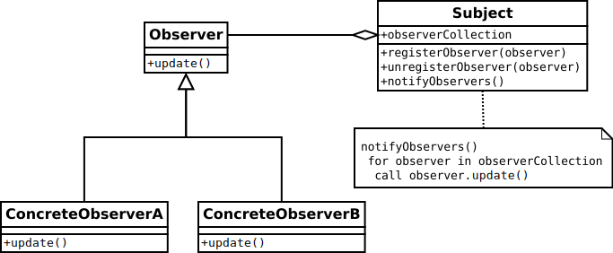

# A Simple Event System

Recently, I needed to develop an event system as part of a bigger C++ project. As I was not using any specific framework that offers such a functionality (e.g., .Net), I had to come up with a simple and quick solution. After some search, I found [this Github project](https://github.com/rafeloken/event_system) which offers a clean implementation of a basic event system using the [Observer pattern](https://www.tutorialspoint.com/design_pattern/observer_pattern.htm). Then, I decided to rewrite, improve and document some portions of the original code. I especially added the `EventArgs` class which allows to pass custom event arguments to all the event subscribers.

## The Observer Pattern

The event system is an implementation of the [Observer pattern](https://www.tutorialspoint.com/design_pattern/observer_pattern.htm). The latter defines an entity called `Subject` which maintains a list of subscribers called `Observer`s. The `Subject` notifies the observers automatically whenever an internal state changes. This notification occurs through calling a specific method of the `Observer` entity. The UML diagram in the following figure shows how the `Subject` and `Observer` entities are structured.

 <br/>
*UML diagram of the Observer pattern* (Source: [wikipedia](https://en.wikipedia.org/wiki/Observer_pattern#UML_class_diagram))

In this implementation, the `Subject` is represented by the `Event` class. However, the `Observer` is represented by the `EventHandler` class.

## Getting Started

The creation of events and adding the event listeners can be easily carried out as follows:

```cpp
// Create a new event
Event event{};

// Create an event handler by specifying the function name
// through which the event handler will be notified of
// any state change within the event instance
EventHandler event_handler(callback_1);

// Add the event handler to the list of event listeners
event.add_handler(event_handler);

// Add another event handler by specifying a function name
event += callback_2;

// The functions callback_1 and callback_2 should be defined
// and implemented beforehand
```

To raise an event, an instance of the `EventArgs` class should be created and passed to the event instance:

```cpp
// Create an EventArgs instance to pass any custom arguments
map<int, string> arg_list = { {1, "property1"}, {2, "property2"}, {3, "property3"} };
int event_type = 100;

EventArgs* args = new EventArgs(event_type, &arg_list);
	
// Raising the event means all listeners are sequentially notified
event(args);
```

## Running an Example

The file [main.cpp](./EventSystem/main.cpp) holds a usage example of the event system. To build the code under Windows, one can use Microsoft Visual Studio (2013, 2017 or 2019). To do so, load the solution file [EventSystem.sln](./EventSystem.sln) into MSVS and hit run. The code does not have any dependencies and is expected to run on both platforms x86 and x64 (Debug and Release configurations).

To build the code under Linux, run the following command in the root folder:

```bash
make
```
The [Makefile](./Makefile) creates a build directory and saves all object files and output executable in that folder.

## Built With

* [Microsoft Visual Studio](https://visualstudio.microsoft.com/) - Visual Studio IDE

## Tested With

* [Microsoft Visual Studio](https://visualstudio.microsoft.com/) - 2013, 2017 and 2019
* [GNU Make](https://www.gnu.org/software/make/) - version 4.1
* [GNU GCC](https://gcc.gnu.org/) - version 7.4.0

## License

This project is licensed under the MIT License - see the [LICENSE](LICENSE) file for details.

## Acknowledgments

* [Original project](https://github.com/rafeloken/event_system)
